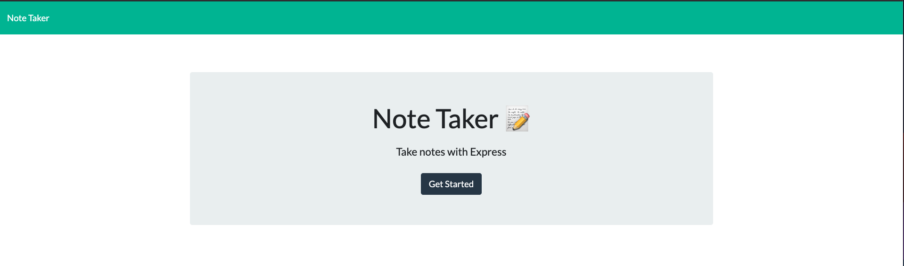
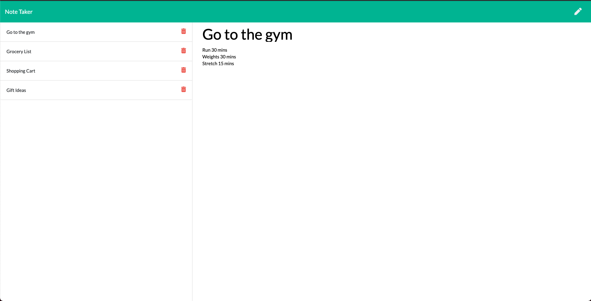

# Note Taker
## Introduction

This week's assingment was to build a note taking website using an Express.js backend interacting with data from a JSON file. In addition, this project needed to be deployed on Heroku. 

### 1. Home Page

The home page has a simple layout with a single "Get Started" button to start the applicaiton.

### 2. Note Page 

The Note page is the main part of the appplication. On the right side of the page is the current note being viewed and on the left side of the page are saved notes. In the header there is a save button and a new note button. The

### 3. Delete Buttons

As a bonus to this assignment, I have added delete buttons for each note. These all use the app.delete function in Express to remove items from out notes column.

### 4. Save and New Buttons

In order to save a note you can click the save icon on the left, and to write a new note click the pen icon on the right.

